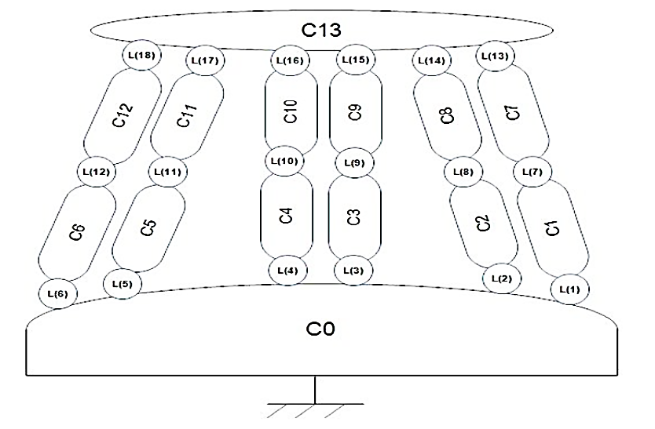
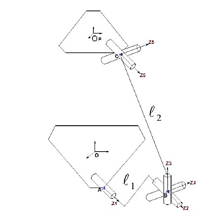
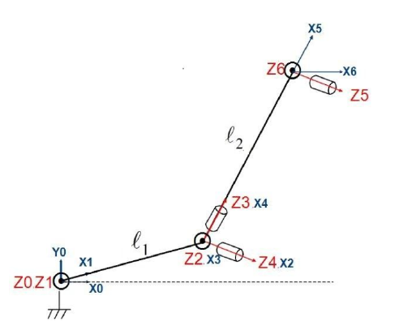
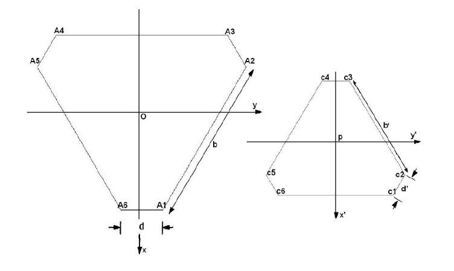
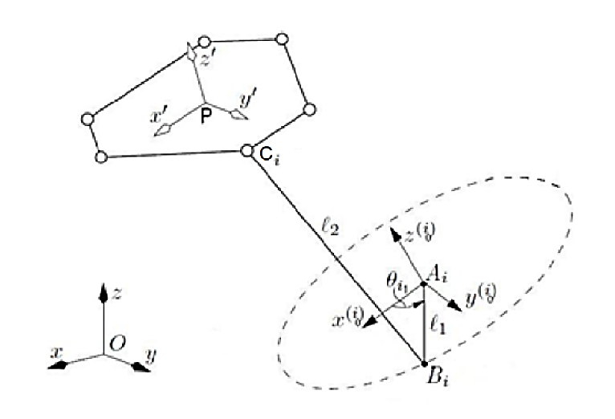

# Ball-and-Plate Control on a 6-DOF Stewart Platform

Position control of a ball rolling on a plate carried by the moving platform of a
six-degree-of-freedom Stewart-Gough hexapod. Ball position is measured by a resistive
touchscreen over RS-232; the controller runs on a **Raspberry Pi**, authored in Simulink
and cross-compiled with Embedded Coder.

Nine controller families were designed and simulated, and most were deployed and run on
the physical rig: PD, PID, pole placement, LQR, sliding mode, super-twisting,
model-reference adaptive, fuzzy and fuzzy-sliding, and a condensed fast MPC.

**Higher Institute for Applied Sciences and Technology (HIAST), Damascus**
Department of Electronic and Mechanical Systems, Electronic Systems Engineering, 2021

---

## Objective

Control the position of a ball moving on a plate carried by a six-armed parallel platform,
so that the ball settles at a desired position or follows a specified trajectory, using a
Raspberry Pi, with ball position acquired by a touchscreen.

Requirements:

1. Control the position of a ball moving on a plane and track a specified trajectory.
2. The plane is carried by a six-armed parallel platform.
3. Ball position is acquired by a touchscreen communicating over RS-232.
4. Simulation and algorithm implementation are carried out in MATLAB.

---

## Mechanism

The platform is a parallel manipulator with six degrees of freedom, three translations
along the principal axes and three rotations about them. It consists of two similar bases,
one fixed and one moving, connected by six legs, with six servo motors mounted on the
fixed base controlling the leg angles. It is one configuration of the Stewart-Gough
parallel platform.

Each leg is a kinematic chain of two bodies connected in a crank-and-rocker arrangement:



| Body | Description |
|---|---|
| `C0` | fixed base platform |
| `C1…C6` | active bodies of the crank-rocker system, driven by the motors, length `AᵢBᵢ = l₁` |
| `C7…C12` | passive bodies, length `BᵢCᵢ = l₂` |
| `C13` | moving upper platform |

| Joints | Type | Between |
|---|---|---|
| `L1…L6` | revolute | base and each active body, about the motor axis |
| `L7…L12` | spherical | active and passive body of each crank-rocker |
| `L13…L18` | universal | passive bodies and the moving platform |



| Parameter | Value |
|---|---|
| Crank length `l₁` | 3.2 |
| Rod length `l₂` | 25.57 |
| Base hexagon | `b = 26`, `d = 20` |
| Top hexagon | `b' = 30`, `d' = 6` |
| Servo travel | ±70° |

---

## Geometric modelling

Coordinate frames are assigned by the Denavit-Hartenberg convention, decomposing the
spherical joint into three revolute joints about mutually perpendicular axes and the
universal joint into two.



| `j` | `σⱼ` | `αⱼ₋₁` | `aⱼ₋₁` | `θⱼ` | `dⱼ` |
|---|---|---|---|---|---|
| 1 | 0 | 0 | 0 | `θᵢ₁` | 0 |
| 2 | 0 | 0 | `l₁` | `θᵢ₂` | 0 |
| 3 | 0 | −π/2 | 0 | `θᵢ₃` | 0 |
| 4 | 0 | −π/2 | 0 | `θᵢ₄` | 0 |
| 5 | 0 | 0 | `l₂` | `θᵢ₅` | 0 |
| 6 | 0 | −π/2 | 0 | `θᵢ₆` | 0 |

The base and platform vertex layouts:



The inverse geometric model gives the six motor angles as a function of the platform pose:



```
θᵢ₁ = atan2(Sᵢ, Cᵢ)
```

with the solution branch constrained to `θᵢ₁ ∈ [−70°, 70°]`.

Full derivation: [docs/kinematics.md](docs/kinematics.md).

---

## Dynamic model

Lagrangian mechanics on the generalized coordinates `q = [xb, yb, α, β]` gives

```
M(q)·q̈ + C(q,q̇)·q̇ + G(q) = τ
```

which, linearized about the horizontal equilibrium, decouples into two identical double
integrators:

```
ẍb = −(5g/7)·α          ÿb = −(5g/7)·β
```

The `5/7` factor follows from the rolling-without-slipping constraint of a solid sphere
(`I = ⅖mr²`), giving a theoretical gain of `5g/7 = 7.007`.

System identification on the physical rig gave:

| Axis | Identified gain | Theoretical |
|------|-----------------|-------------|
| x | 6.1486 | 7.007 |
| y | 6.664 | 7.007 |

The hardware controllers use separate gains per axis.

Full derivation: [docs/modelling.md](docs/modelling.md).

---

## Controllers

| Family | Simulation | On hardware | Notes |
|---|:---:|:---:|---|
| PD | ✓ | ✓ | Continuous and discrete; state-space form with observer |
| PID | ✓ | ✓ | Gains assigned by pole placement on the augmented plant |
| Pole placement | ✓ | ✓ | Continuous, discrete, and with integral action |
| LQR / dLQR | ✓ | ✓ | `Q = diag(4,1)`, `R = 2`, discretized at `Ts` |
| Sliding mode | ✓ | ✓ | `s = ẋ + λx`, boundary layer |
| Super-twisting | ✓ | ✓ | Second-order sliding mode |
| MRAC | ✓ | No | Reference model `ζ = 1.1`, `ωₙ = 2`, `Γx = diag(35,10)` |
| Fuzzy / fuzzy-sliding | ✓ | ✓ | Mamdani FIS; the hybrid tunes the sliding-mode gain |
| Fast MPC | ✓ | No | Condensed form, `N = 50`, `Nu = 5`, gains precomputed offline |

Since the touchscreen measures position only, the controllers are paired with discrete
Luenberger observers to reconstruct velocity.

Common constraints: plate tilt saturated at ±5°, a ±1.5 mm deadband on the position
error, and a sample time of `Ts = 0.02 s` (50 Hz) on hardware.

---

## Hardware

| | |
|---|---|
| Compute | Raspberry Pi, GPIO 12, 20, 16, 17, 27, 22 |
| Servos | 6, 50 Hz PWM, travel ±70° |
| Sensor | 4-wire resistive touchscreen, RS-232 at 19200 baud, active area ≈ 22.8 × 30.4 cm |
| Home pose | `(0, 0, 23, 0, 0, 0)` |

Each servo is calibrated individually: `Angle2Duty.m` holds six measured angle-to-pulse-width
tables, each linearly fitted, with alternating sign for the mirrored servos.

Serial protocol, pinout and calibration: [docs/hardware.md](docs/hardware.md).

---

## Toolchain

- MATLAB / Simulink R2020a, `*_2016.slx` copies are provided for older installations
- Symbolic Math Toolbox, Control System Toolbox, Fuzzy Logic Toolbox
- Simulink Coder / Embedded Coder, `ert.tlc`, ARM Cortex target
- Simulink Support Package for Raspberry Pi, PWM, Serial Read, deployment
- External mode over XCP/TCP-IP for live tuning and signal logging

---

## Repository layout

```
src/
├── model/            Symbolic Euler-Lagrange derivation, plant models, observer
├── kinematics/       Inverse geometric model of the 6-RSS platform
├── hardware/         Servo calibration, PWM driver, serial bring-up models
├── identification/   Identification model and logged data
└── control/          Nine controller families, each split:
    ├── <family>/sim/   simulation, plant model in the loop
    └── <family>/rpi/   deployed to the Raspberry Pi

experiments/          Logged results from the physical rig
docs/                 Modelling, kinematics, hardware interface
└── figures/          Mechanism and kinematics diagrams
```

A `sim` model closes the loop on the linearized plant inside Simulink. An `rpi` model
replaces that plant with a Serial Read block, six PWM blocks and the inverse-kinematics
function.

---

## Running

**Simulation:**

1. Run the controller's parameter script, e.g. `src/control/lqr/sim/LQR.m`, to populate
   the workspace with the gains the model expects.
2. Open the matching `.slx` in the same folder and simulate.

**On hardware:**

1. Run `src/hardware/Motors.m` to configure the six PWM pins and move the platform to its
   home pose.
2. Run the `rpi/` parameter script for the chosen controller.
3. Open the `rpi/` model, set the board address under *Hardware Implementation*, and
   deploy, or run in external mode.

Each model reads its gains from the base workspace, so the parameter script must be run
before the model is opened.

---

## Results

`experiments/` holds logs captured from the physical rig: step responses for PD, sliding
mode and super-twisting, and circular trajectory tracking for super-twisting. See
[experiments/README.md](experiments/README.md).

---

## Status

- MRAC and fast MPC were simulated but not deployed.
- `src/model/Kinematics.m` solves a Lyapunov equation and checks controllability of the
  double integrator, despite its name.

---

## License

Code: MIT, see [LICENSE](LICENSE). Figures and documentation: CC BY 4.0.
