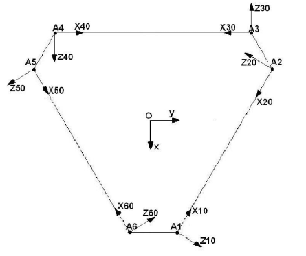

# Inverse Kinematics of the 6-RSS Stewart Platform

The controller produces a desired plate tilt `(α, β)`; the platform requires six motor
angles. Implementation: [`src/kinematics/inv_ken.m`](../src/kinematics/inv_ken.m), which is
also compiled into every `rpi/` model as a MATLAB Function block and executes on the
Raspberry Pi at each sample.

---

## 1. Mechanism

A 6-RSS parallel manipulator: six identical legs, each a crank-and-rocker chain.


| Body | Description |
|---|---|
| `C0` | fixed base platform |
| `C1…C6` | active bodies (motor cranks), length `AᵢBᵢ = l₁` |
| `C7…C12` | passive bodies (rods), length `BᵢCᵢ = l₂` |
| `C13` | moving upper platform |

| Joint set | Type | Between |
|---|---|---|
| `L1…L6` | revolute, about `(Aᵢ, Zᵢ)` | base `C0` and each active body |
| `L7…L12` | spherical, about `(Bᵢ, Z₂, Z₃, Z₄)` | active and passive body |
| `L13…L18` | universal, about `(Cᵢ, Z₅, Z₆)` | passive bodies and moving platform |

Only the six revolute joints are actuated.


| Parameter | Value |
|---|---|
| Crank length `l₁` | 3.2 |
| Rod length `l₂` | 25.57 |
| Base hexagon | `b = 26`, `d = 20` |
| Top hexagon | `b' = 30`, `d' = 6` |
| Servo travel | ±70° |

---

## 2. Denavit-Hartenberg parameterization

Frames are placed by the DH convention: `Zⱼ` along the axis of joint `j`, `Xⱼ` along the
common perpendicular of `Zⱼ` and `Zⱼ₊₁`, the frame origin at their intersection, and `Yⱼ`
completing the right-handed set. Compound joints are treated as superpositions of simple
revolute joints, the spherical joint as three, the universal joint as two.


The four DH quantities are `σⱼ` (joint type), `αⱼ₋₁` (link twist), `aⱼ₋₁` (link length),
`θⱼ` (joint angle) and `dⱼ` (link offset), determining

```
             ⎡ cos θⱼ              −sin θⱼ             0            aⱼ₋₁        ⎤
Tⱼ₋₁,ⱼ  =    ⎢ sin θⱼ·cos αⱼ₋₁   cos θⱼ·cos αⱼ₋₁   −sin αⱼ₋₁   −dⱼ·sin αⱼ₋₁  ⎥
             ⎢ sin θⱼ·sin αⱼ₋₁   cos θⱼ·sin αⱼ₋₁    cos αⱼ₋₁    dⱼ·cos αⱼ₋₁  ⎥
             ⎣ 0                   0                  0            1           ⎦
```

For each leg `i`:

| `j` | `σⱼ` | `αⱼ₋₁` | `aⱼ₋₁` | `θⱼ` | `dⱼ` |
|---|---|---|---|---|---|
| 1 | 0 | 0 | 0 | `θᵢ₁` | 0 |
| 2 | 0 | 0 | `l₁` | `θᵢ₂` | 0 |
| 3 | 0 | −π/2 | 0 | `θᵢ₃` | 0 |
| 4 | 0 | −π/2 | 0 | `θᵢ₄` | 0 |
| 5 | 0 | 0 | `l₂` | `θᵢ₅` | 0 |
| 6 | 0 | −π/2 | 0 | `θᵢ₆` | 0 |

Two constant transforms complete the chain: `T_Base,i0` between the base frame and the
leg frame `Rᵢ₀`, and `T_i6,Top` between `Rᵢ₆` and the platform frame. The full chain is

```
T_Base,Top = T_Base,i0 · T_i0,1 · T_i1,2 · T_i2,3 · T_i3,4 · T_i4,5 · T_i5,6 · T_i6,Top
```

`θᵢ₁` is the actuated input: the angle between `Xᵢ₀` and `Xᵢ₁`, i.e. between the leg's
local axis and the crank vector `AᵢBᵢ`.

---

## 3. Frames and vertex coordinates

- `(O, X, Y, Z)`: base frame at the centre of the fixed base, `Z` upward.
- `(Op, X', Y', Z')`: top frame at the centre of the moving platform, `Z'` normal to it.
- `Rᵢ₀`: fixed frames at each vertex `Aᵢ`, with `Zᵢ₀` along the motor axis and `Xᵢ₀`
  along the long edge of the base hexagon.
- `Rᵢ₁…Rᵢ₆`: placed by the DH convention.



Base vertices in the base frame:

```
PA1 = [ (2b+d)/√12 ,   d/2    , 0 ]
PA2 = [ −(b−d)/√12 , (b+d)/2  , 0 ]
PA3 = [ −(b+2d)/√12,   b/2    , 0 ]
PA4 = [ −(b+2d)/√12,  −b/2    , 0 ]
PA5 = [ −(b−d)/√12 , −(b+d)/2 , 0 ]
PA6 = [ (2b+d)/√12 ,  −d/2    , 0 ]
```

Platform vertices `P'Cᵢ` follow the same pattern in the top frame with `b'` and `d'`.


The constant rotations to the leg frames:

| Leg | `A_Base,i0` |
|---|---|
| 1 | `Rot(Z, 150°)·Rot(X, 90°)` |
| 2 | `Rot(Z, −30°)·Rot(X, 90°)` |
| 3 | `Rot(Z, −90°)·Rot(X, 90°)` |
| 4 | `Rot(Z, 90°)·Rot(X, 90°)` |
| 5 | `Rot(Z, 30°)·Rot(X, 90°)` |
| 6 | `Rot(Z, −150°)·Rot(X, 90°)` |

---

## 4. Inverse geometric model

The platform pose is given by the position `P = [px, py, pz]` and the yaw-pitch-roll
angles `(φ, θ, ψ)`, with

```
A_Base,Top = Rot(Z, φ)·Rot(Y, θ)·Rot(X, ψ)
```


For each leg `i`, the point `Bᵢ` lies at distance `l₁` from `Aᵢ` in the plane
`(xᵢ₀, yᵢ₀)`, since the revolute joint between `Aᵢ` and `Bᵢ` constrains it to that plane.
The required motor angle `θᵢ₁` is the angle between `xᵢ₀` and the vector `AᵢBᵢ`. For a
given platform pose, `Cᵢ` is known in the fixed frame and `‖BᵢCᵢ‖ = l₂` is constant.

**Step 1**: platform vertices in the base frame:

```
r_OCᵢ = T_Base,Top · [P'Cᵢ ; 1]
```

**Step 2**: leg lengths:

```
Lᵢ = √( (XCᵢ − XAᵢ)² + (YCᵢ − YAᵢ)² + (ZCᵢ − ZAᵢ)² )
```

**Step 3**: express in the leg frame:

```
r_AᵢCᵢ = r_OCᵢ − r_OAᵢ            (r_AᵢCᵢ)^(i0) = (T_Base,i0)⁻¹ · r_AᵢCᵢ
```

giving components `(XCᵢ^(i0), YCᵢ^(i0), ZCᵢ^(i0))`.

**Step 4**: from Chasles' relation, `r_BᵢCᵢ = r_AᵢCᵢ − r_AᵢBᵢ`; squaring both sides:

```
l₂² = Lᵢ² + l₁² − 2·(r_AᵢCᵢ^(i0))ᵀ·(r_AᵢBᵢ^(i0))
```

With `r_AᵢBᵢ^(i0) = l₁·[cos θᵢ₁, sin θᵢ₁, 0]ᵀ` this reduces to a scalar equation:

```
XCᵢ^(i0)·cos θᵢ₁ + YCᵢ^(i0)·sin θᵢ₁ = (Lᵢ² + l₁² − l₂²) / (2·l₁) ≡ Nᵢ
```

**Step 5**: squaring gives a quadratic in `sin θᵢ₁`. Real solutions require

```
Γᵢ = (XCᵢ^(i0))² + (YCᵢ^(i0))² − Nᵢ² ≥ 0
```

and then

```
sin θᵢ₁ = ( Nᵢ·YCᵢ^(i0) + XCᵢ^(i0)·δ·√Γᵢ ) / ( (XCᵢ^(i0))² + (YCᵢ^(i0))² ) = Sᵢ
cos θᵢ₁ = ( Nᵢ·XCᵢ^(i0) − YCᵢ^(i0)·δ·√Γᵢ ) / ( (XCᵢ^(i0))² + (YCᵢ^(i0))² ) = Cᵢ

θᵢ₁ = atan2(Sᵢ, Cᵢ)
```

**Step 6**: `δ = ±1` gives two solutions per leg. Since the motor range is
`[−70°, 70°]`, the solution satisfying `θᵢ₁ ∈ [−70°, 70°]` is selected.

---

## 5. Implementation

`inv_ken.m` fixes `δ = 1` and applies `abs()` to the cosine term inside the `atan2` call,
which selects the correct branch over the tilt range the controller commands (±5°).

The function does not test `Γᵢ ≥ 0`; an unreachable pose returns `NaN`. In the deployed
loop the ±5° tilt saturation ahead of the inverse kinematics keeps every commanded pose
inside the workspace.

Angles are returned in degrees via `atan2d`, which is the unit `Angle2Duty.m` expects.

`inv_ken2.m` is an earlier variant. [`inv_ken_test.slx`](../src/kinematics/inv_ken_test.slx)
exercises the function in simulation.

---

## 6. Forward kinematics

Not required. The control loop only needs the mapping from platform pose to motor angles.
Forward kinematics of a parallel manipulator has no closed form and requires iterative
numerical solution.
